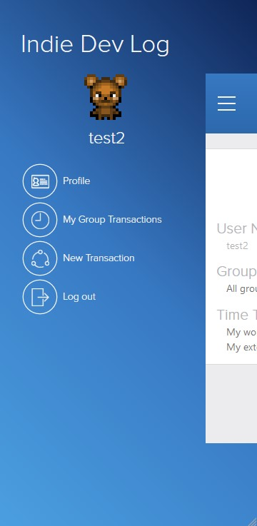

<!-- PROJECT SHIELDS -->
<!--
*** I'm using markdown "reference style" links for readability.
*** Reference links are enclosed in brackets [ ] instead of parentheses ( ).
*** See the bottom of this document for the declaration of the reference variables
*** for contributors-url, forks-url, etc. This is an optional, concise syntax you may use.
*** https://www.markdownguide.org/basic-syntax/#reference-style-links
-->

[![Contributors][contributors-shield]][contributors-url]
[![Forks][forks-shield]][forks-url]
[![Stargazers][stars-shield]][stars-url]
[![Issues][issues-shield]][issues-url]
[![MIT License][license-shield]][license-url]
[![LinkedIn][linkedin-shield]][linkedin-url]

<!-- PROJECT LOGO -->
<br />
<p align="center">
  

  <h3 class ="norse" align="center" style="@font-face {font-family: 'Norse'; src: url('/fonts/Norse.otf'); font-family:'Norse'}">Project 9: RoR_CapstoneProject_Transactions</h3>

  <p align="center">
    A social scaffold
    <br />
    <br />
  </p>
</p>

<!-- TABLE OF CONTENTS -->

## Table of Contents

- [Table of Contents](#table-of-contents)
- [About The Project](#about-the-project)
  - [Built With](#built-with)
- [Getting Started](#getting-started)
  - [Prerequisites](#prerequisites)
  - [Installation](#installation)
- [Usage](#usage)
  - [Testing](#testing)
- [Credits](#credits)
- [Contact](#contact)

<!-- ABOUT THE PROJECT -->

## About The Project


[Microverse](https://www.microverse.org/) Ruby on Rails Capstone Project "Group our transactions"

Project: Ruby on Rails Capstone Project: Group our transactions. [Assignment link](https://www.notion.so/Group-our-transactions-ccea2b6642664540a70de9f30bdff4ce)

Visit the finished project website: https://quiet-earth-68023.herokuapp.com/
<div style="text-align:center">
  <a href="https://quiet-earth-68023.herokuapp.com//">
      
  </a>
</div>

### Built With

- [Ruby](https://www.ruby-lang.org)
- [Ruby on Rails](https://rubyonrails.org/)

## Getting Started

### Prerequisites


* Windows
```sh
https://www.ruby-lang.org/es/documentation/installation/#rubyinstaller
https://gorails.com/setup/windows/10
```
* Ubuntu 18.04
```sh
sudo apt-get install ruby-full
gem install rails -v 5.2.4.3
```
### Installation

1. Clone the repo

```sh
git clone https://github.com/jdmartinez1062/RoR_CapstoneProject_Transactions
```
<!-- USAGE EXAMPLES -->
## Usage

1. Visit the web page
   
        https://quiet-earth-68023.herokuapp.com/

2. Log in or create a new user if you don't have one.

3. To access time spents and external time spents for your user do it through the profile page. To access a group time spents do it on that group's page by searching for it in the "All groups" link.
   
4. To create a new group follow the "All Groups" link and click on "create new".   

5. To create a new time spent click on the menu and on "New Transaction". You will need to have created a group previously to be able to select a group. 

### Testing

To test the app run the following command in the console:

        rspec 

## Credits
This app was inspired on a design idea by [Gregoire Vella on Behance](https://www.behance.net/gregoirevella)

<!-- CONTACT -->

## Contact

Juan David Martínez Cubillos - jd.martinez1062@gmail.com

Project Link: [https://github.com/jdmartinez1062/RoR_CapstoneProject_Transactions](https://github.com/jdmartinez1062/RoR_CapstoneProject_Transactions)

<!-- ACKNOWLEDGEMENTS -->


<!-- MARKDOWN LINKS & IMAGES -->
<!-- https://www.markdownguide.org/basic-syntax/#reference-style-links -->

[contributors-shield]: https://img.shields.io/github/contributors/jdmartinez1062/RoR_CapstoneProject_Transactions.svg?style=flat-square
[contributors-url]: https://github.com/jdmartinez1062/RoR_CapstoneProject_Transactions/graphs/contributors
[forks-shield]: https://img.shields.io/github/forks/jdmartinez1062/RoR_CapstoneProject_Transactions.svg?style=flat-square
[forks-url]: https://github.com/jdmartinez1062/RoR_CapstoneProject_Transactions/network/members
[stars-shield]: https://img.shields.io/github/stars/jdmartinez1062/RoR_CapstoneProject_Transactions.svg?style=flat-square
[stars-url]: https://github.com/jdmartinez1062/RoR_CapstoneProject_Transactions/stargazers
[issues-shield]: https://img.shields.io/github/issues/jdmartinez1062/RoR_CapstoneProject_Transactions.svg?style=flat-square
[issues-url]: https://github.com/jdmartinez1062/RoR_CapstoneProject_Transactions/issues
[license-shield]: https://img.shields.io/github/license/jdmartinez1062/RoR_CapstoneProject_Transactions.svg?style=flat-square
[license-url]: https://github.com/jdmartinez1062/RoR_CapstoneProject_Transactions/blob/master/LICENSE.txt
[linkedin-shield]: https://img.shields.io/badge/-LinkedIn-black.svg?style=flat-square&logo=linkedin&colorB=555
[linkedin-url]: https://linkedin.com/in/othneildrew
[product-screenshot]: imgs/screenshot.jpg

